## 날짜
2017년 2월 22일

## 장소
[네이버 D2 스타트업 팩토리](http://www.d2startup.com/) - 서울특별시 강남구 강남대로 382 메리츠타워 16층

## 모임 링크
http://onoffmix.com/event/90317

## 참석인원
- 등록 : 121명
- 참석 : 130명

## 발표 (발표자료는 각 제목에 링크되어 있음.)
- 김종민 - [Elastic Stack Overview](http://kimjmin.net/2017/03/2017-02-seoul-meetup/Elastic-Stack-Overview.pdf)
- 허광남 - [커뮤니티 로그 데이터 활용](http://kimjmin.net/2017/03/2017-02-seoul-meetup/ELK-on-OKKY-HeoKN.pdf)
- 김정환 - [시스템 운영 아키텍쳐, Logstash 설정과 트러블 슈팅](http://kimjmin.net/2017/03/2017-02-seoul-meetup/elasticsearch-in-nbt.pdf)
- 김종민 - [Elastic 시작하기 & 커뮤니티 운영 방안](http://kimjmin.net/2017/03/2017-02-seoul-meetup/community-plan.pdf)

## 사전 설문
총 137 응답 (일부 중복 답변 있음)
사전 설문 관련 포스팅 - http://kimjmin.net/2017/02/2017-02-meetup-survey/

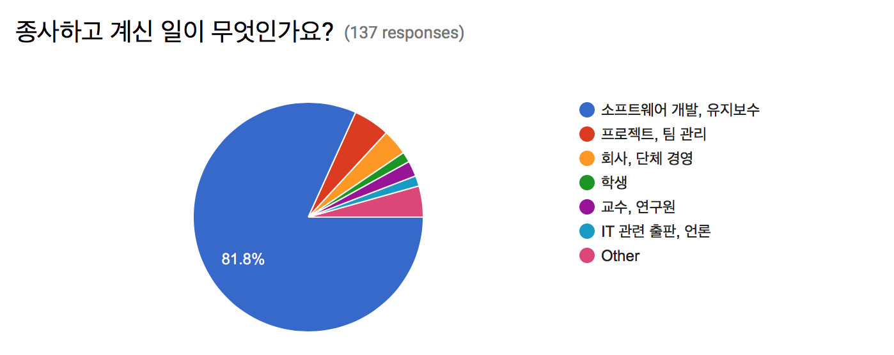 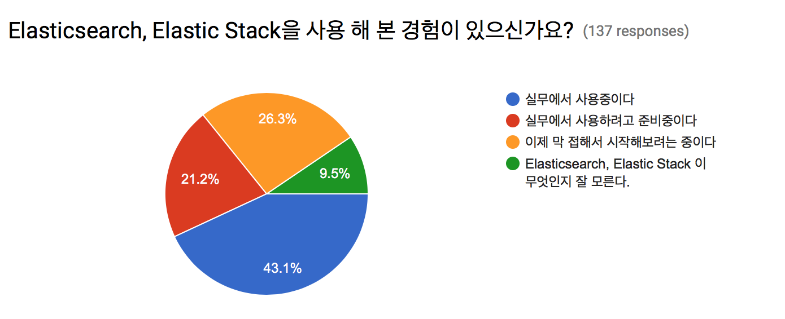 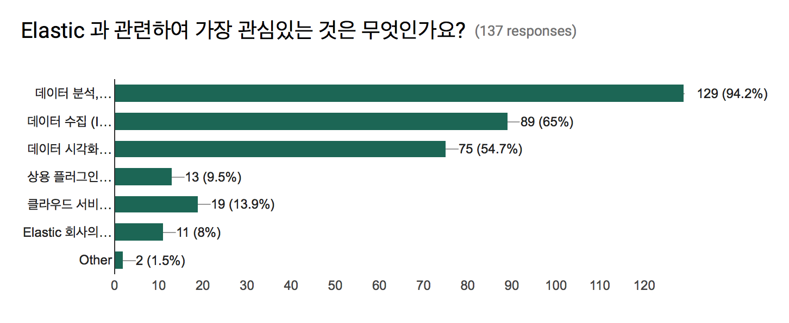 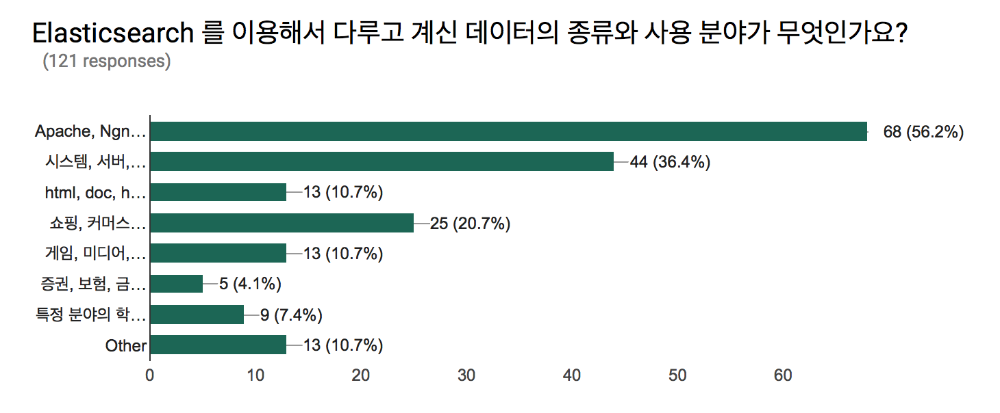 

## 행사 사진

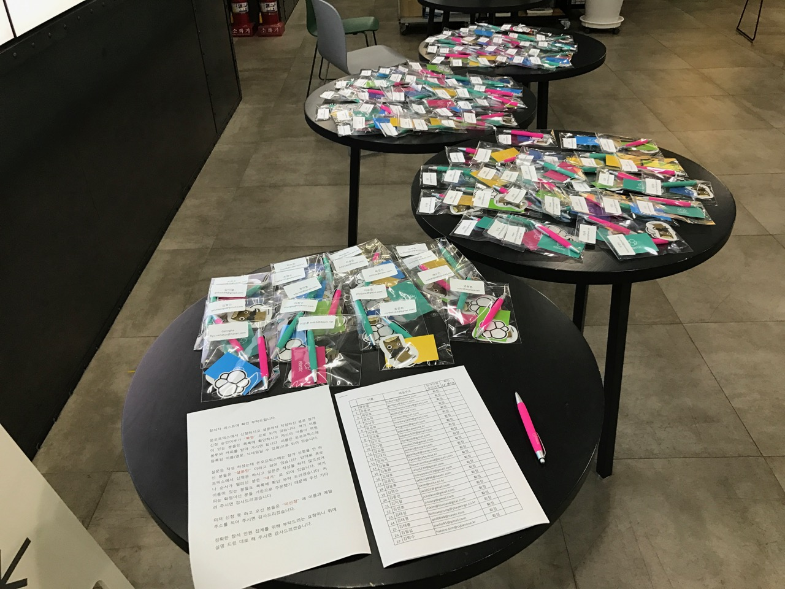 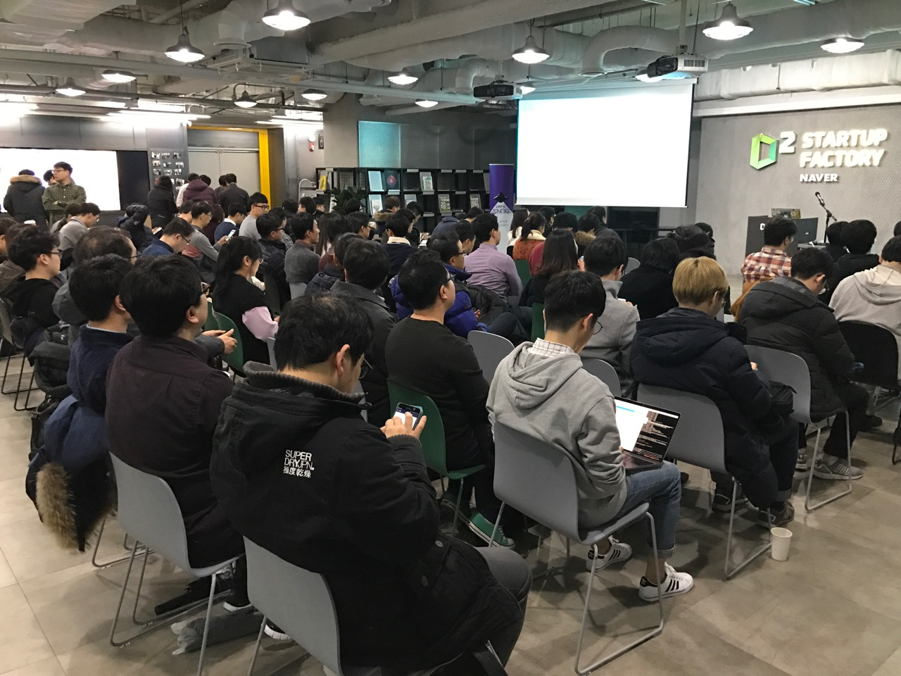 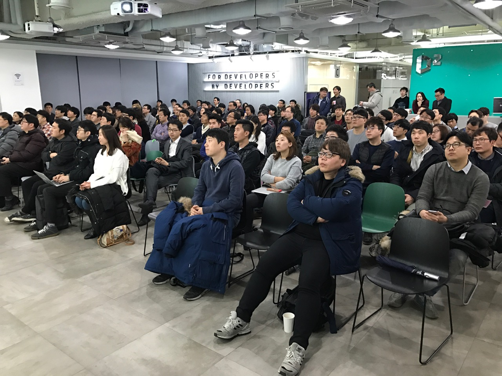 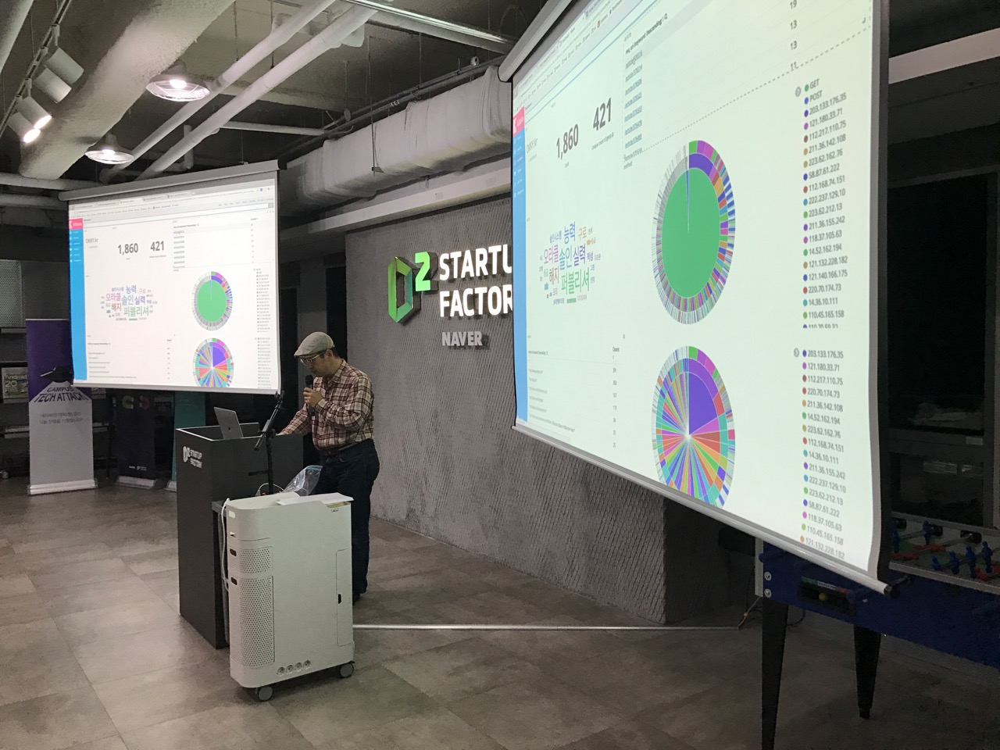 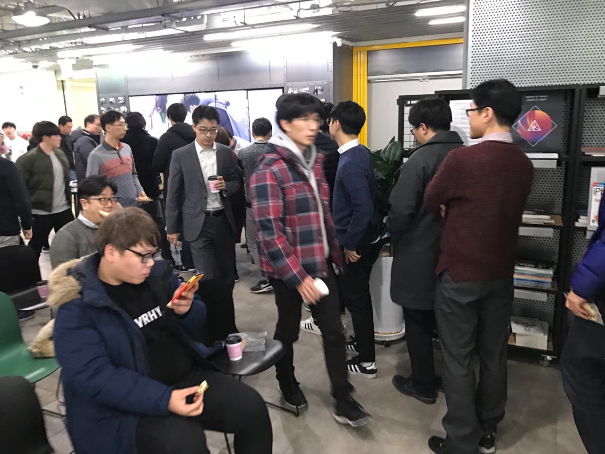 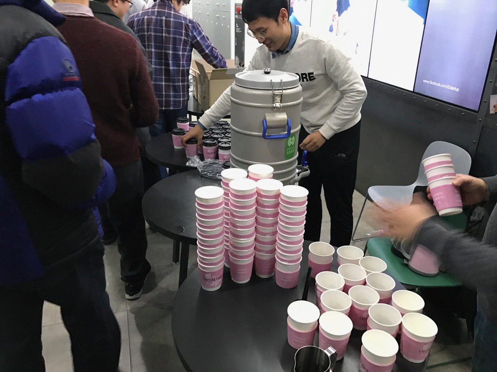 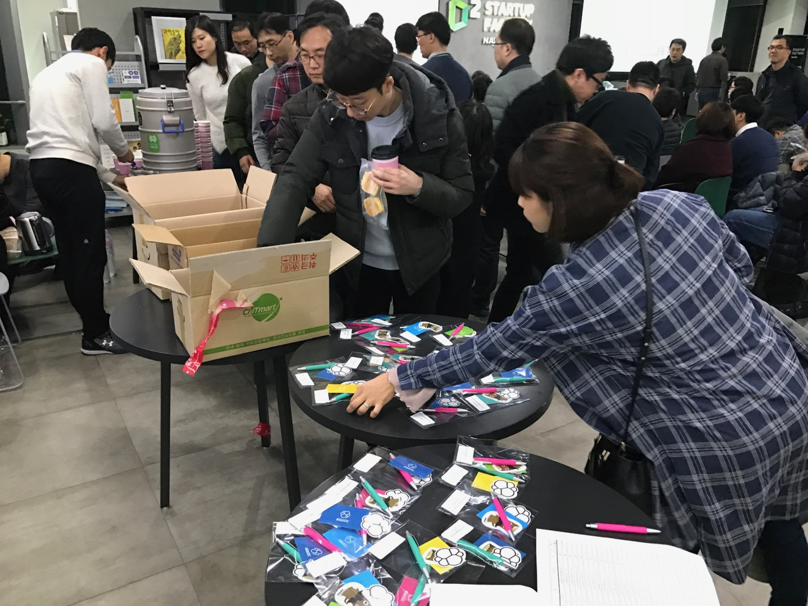 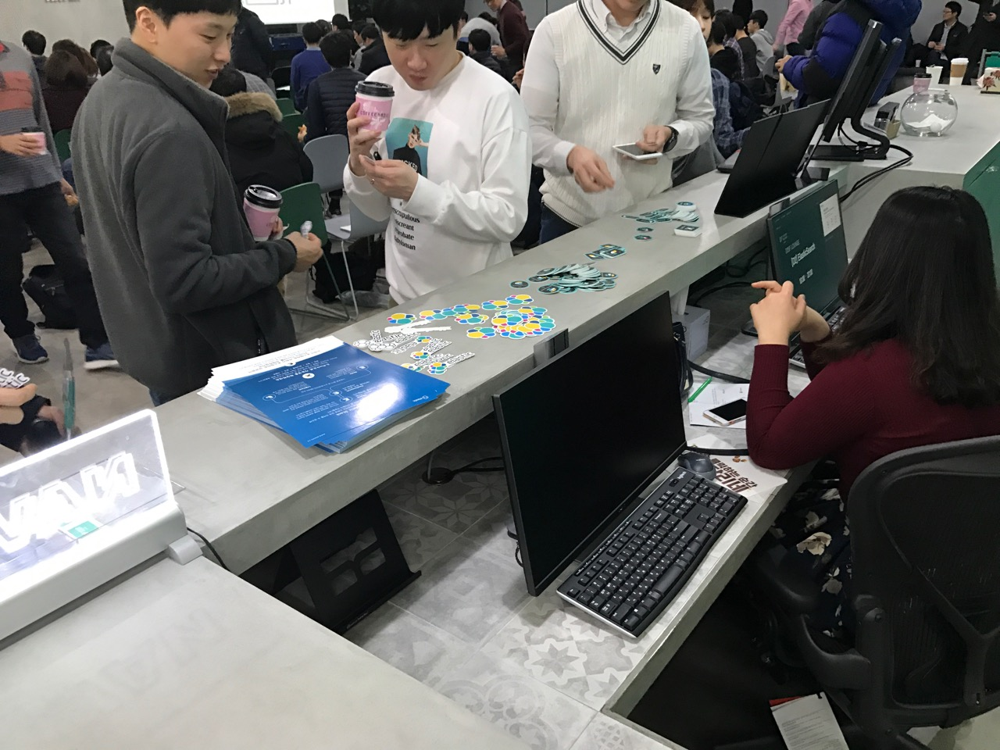 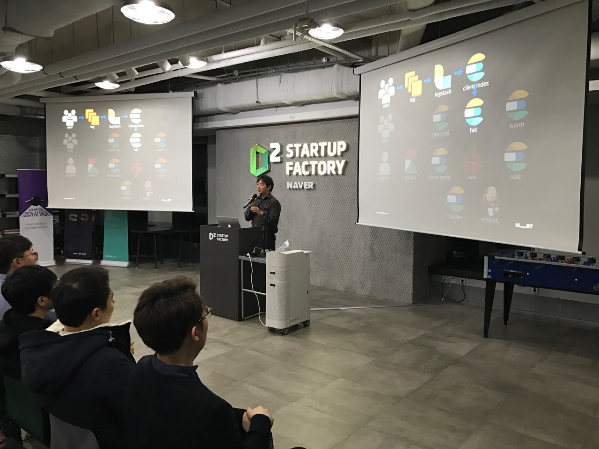 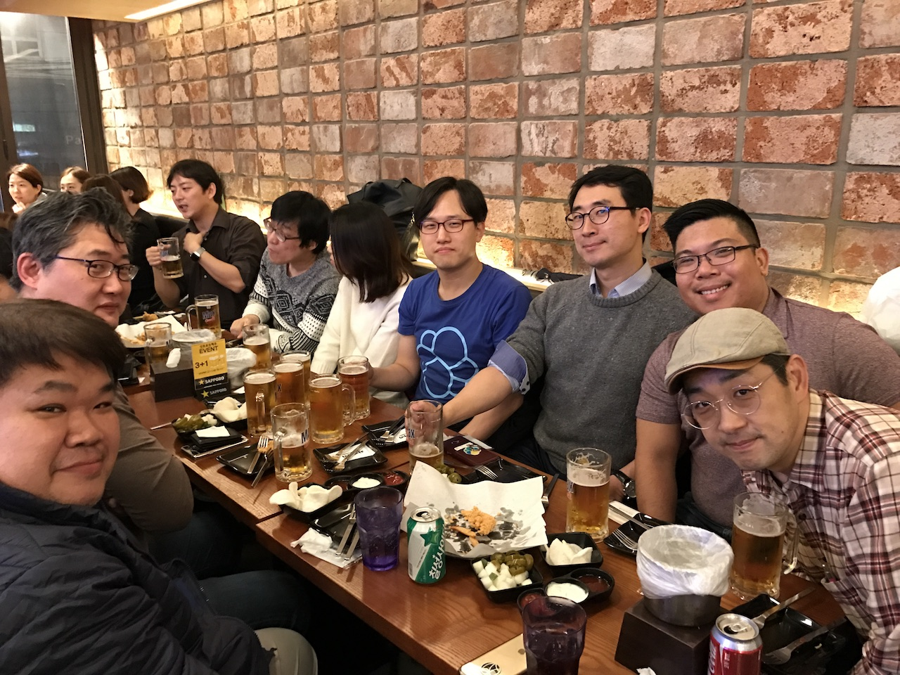 

