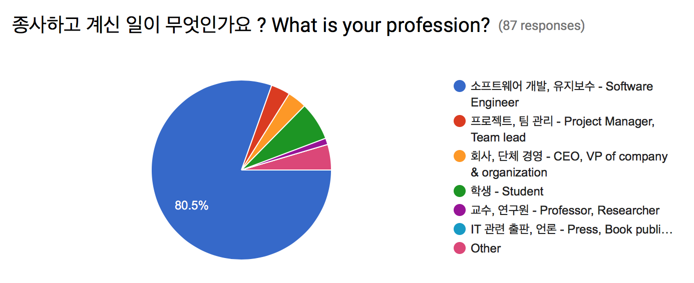
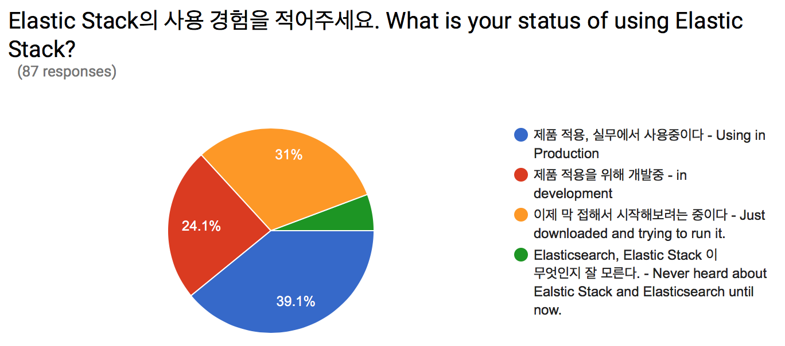
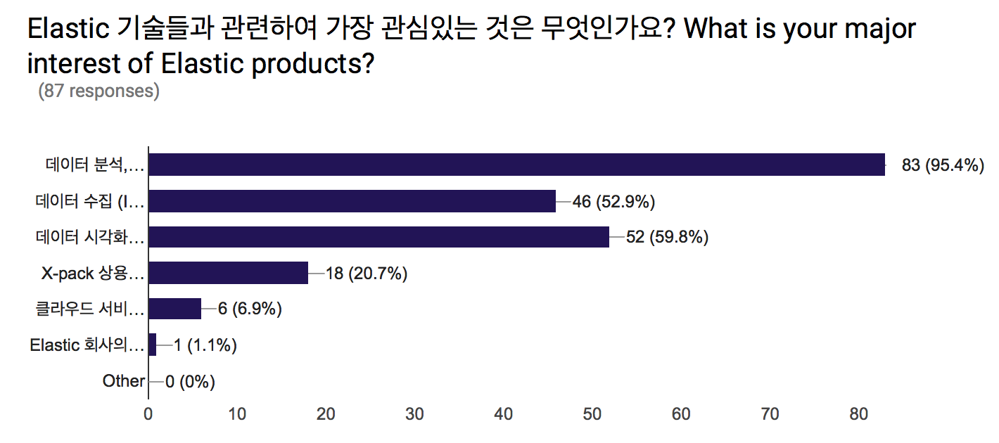
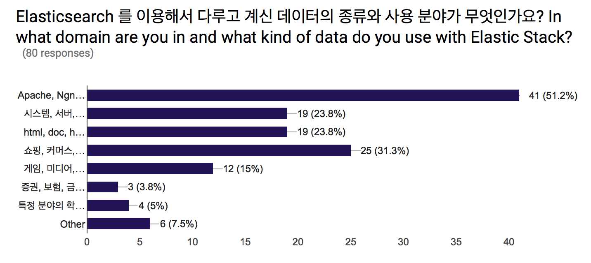
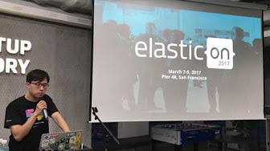

## 날짜
2017년 4월 13일

## 장소
[네이버 D2 스타트업 팩토리](http://www.d2startup.com/) - 서울특별시 강남구 강남대로 382 메리츠타워 16층

## 모임 링크
http://onoffmix.com/event/95434

## 참석인원
- 등록 : 150명
- 참석 : 90명

## 발표 (발표자료는 각 제목에 링크되어 있음.)
- 김종민 - [Elastic{on} 17 Keynote Overview](https://drive.google.com/open?id=0ByqsUCpttxAGUk5mYXpzRGxuUXc)
- 유지영 - [Fast follower First mover](https://drive.google.com/open?id=0ByqsUCpttxAGcHRkZ3hRQ2k4dUU)
- 이윤미 - [Elastic Cloud Enterprise 소개 with elasticOn 참여후기](https://drive.google.com/open?id=0ByqsUCpttxAGd2MybG11NzQ5N00)
- 김종민 - Elastic Stack Product Updates (Keynote 슬라이드에 포함)

## 사전 설문
총 87 응답

    

## 발표 영상

