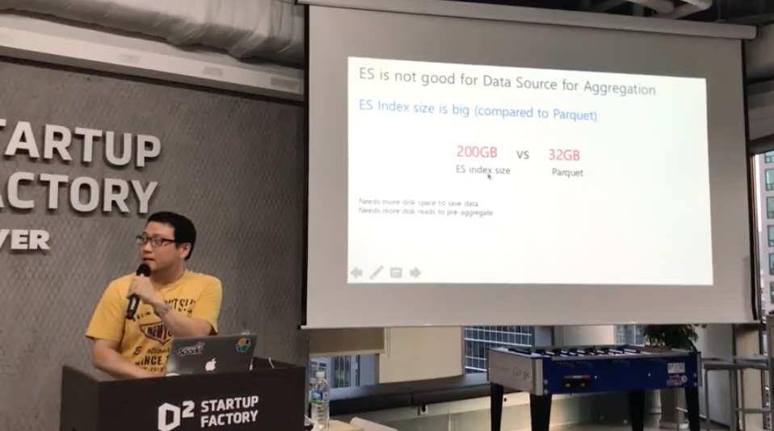

## 날짜
2017년 6월 22일

## 장소
[네이버 D2 스타트업 팩토리](http://www.d2startup.com/) - 서울특별시 강남구 강남대로 382 메리츠타워 16층

## 모임 링크
http://onoffmix.com/event/101650

## 참석인원
- 등록 : 240명 (onoffmix 참여 + 대기자)
- 참석 : 120명

## 발표 (발표자료는 각 제목에 링크되어 있음.)
- 김종민 - 5.4 Feature Review & Machine Learning (슬라이드 없음)
- 허정수 - [Web Analytics at Scale with Elasticsearch @ naver.com](https://s3.ap-northeast-2.amazonaws.com/kr.elastic.co/meetups/20170622/es-meetup-0622-jsheo-part1.pdf)
- 박영민 - [Elaticsearch Engine 을 DataBase 로 활용](https://s3.ap-northeast-2.amazonaws.com/kr.elastic.co/meetups/20170622/elastic-meetup-0622-YoungminPark.pdf)
- 김종민 - [Meetup Survey 및 공지사항](https://s3.ap-northeast-2.amazonaws.com/kr.elastic.co/meetups/20170622/meetup-survey-170622-kjm.pdf)

## 사전 설문
총 113명 응답 - [Meetup Survey 및 공지사항](https://s3.ap-northeast-2.amazonaws.com/kr.elastic.co/meetups/20170622/meetup-survey-170622-kjm.pdf) 슬라이드에 내용 포함

   

## 발표 영상

https://youtu.be/Mc9gy-5d60w
