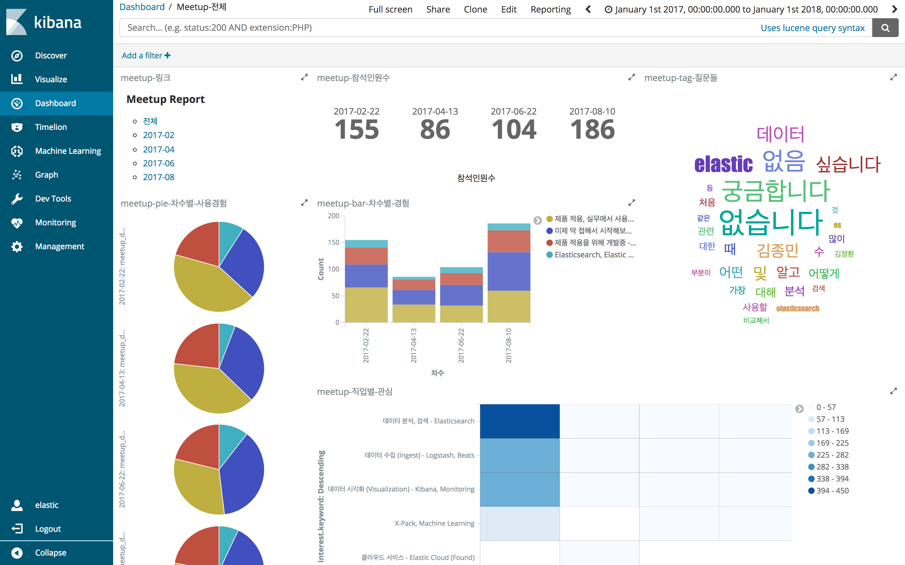
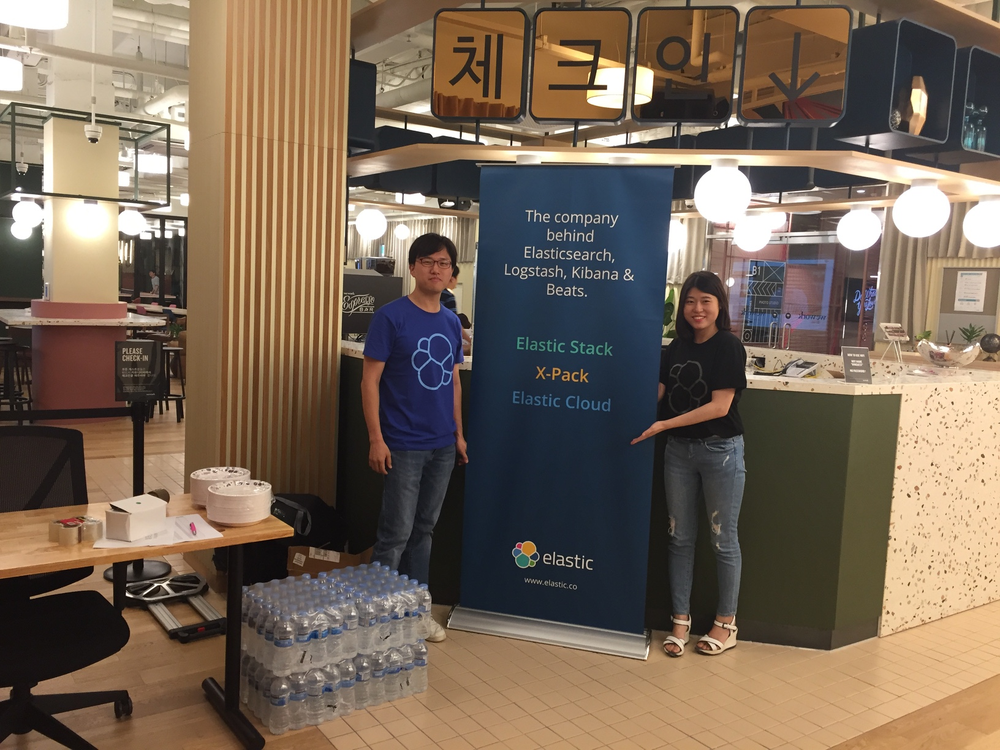
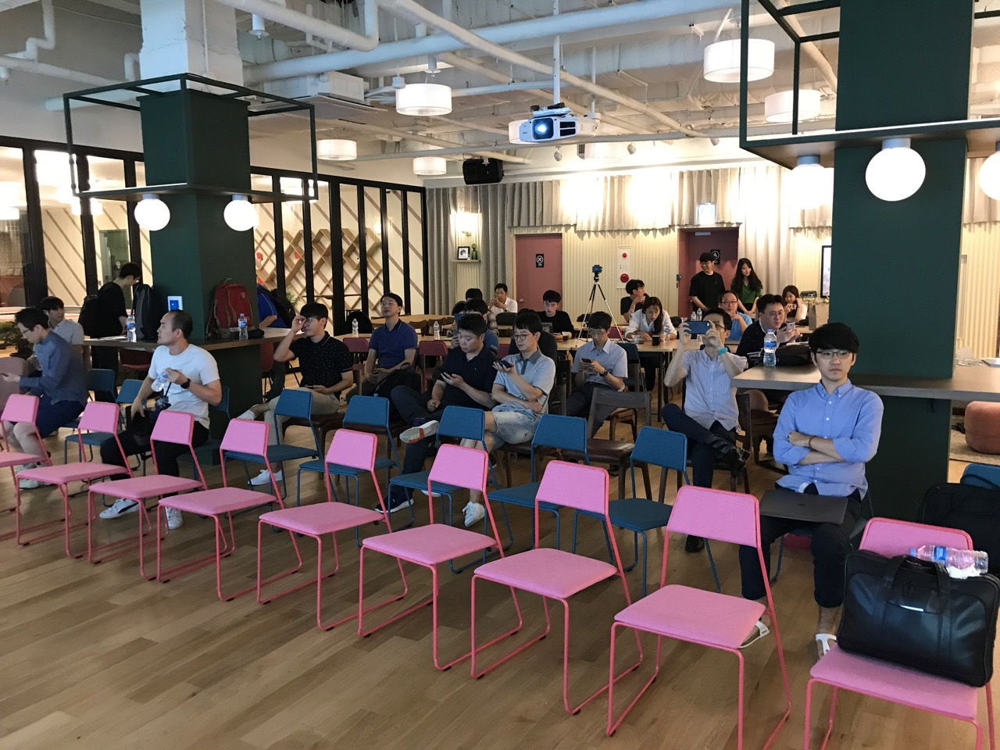
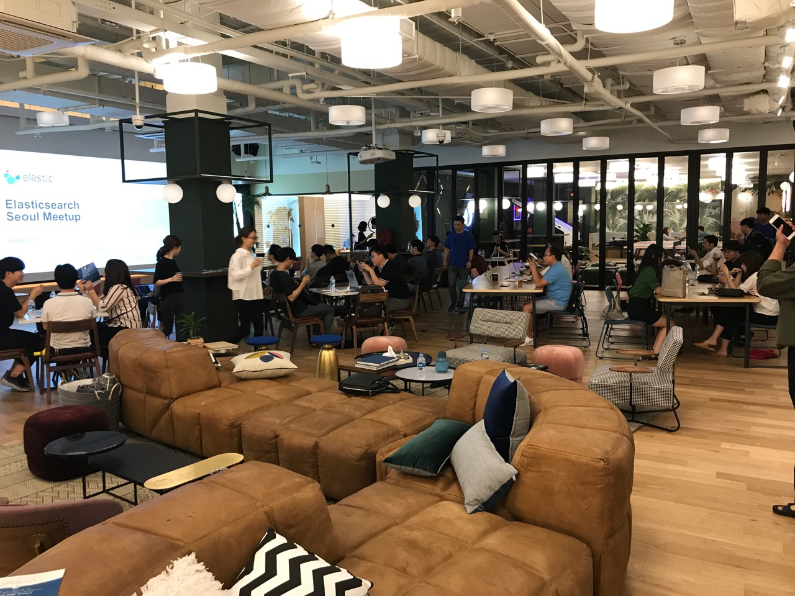
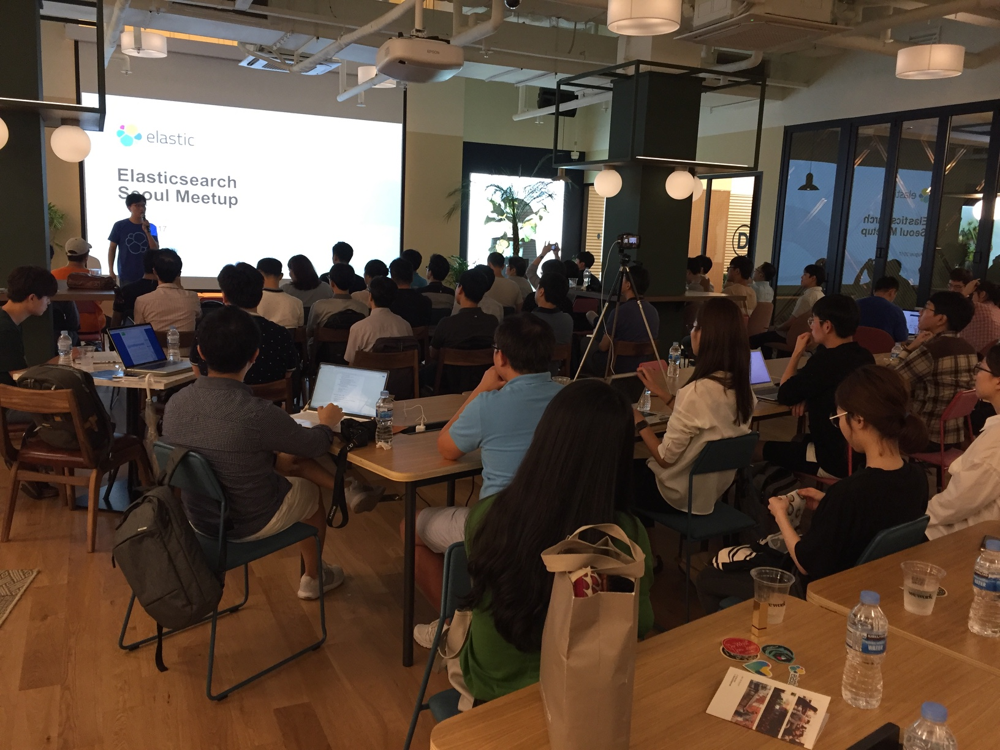

이번 밋업은 ~~담당자의 실수~~ 기술적인 문제로 동영상 촬영을 하지 못했습니다. 죄송합니다.

## 날짜
2017년 8월 10일

## 장소
[Elastic 한국 오피스 - WeWork 삼성역점](https://www.wework.com/ko-KR/buildings/samseong-station--seoul) - 서울 강남구 테헤란로 507

## 모임 링크
https://onoffmix.com/event/108684

## 참석인원
- 등록 : 200명 (onoffmix 참여 + 대기자)
- 참석 : 90명

## 발표 (발표자료는 각 제목에 링크되어 있음.)
- 김종민 - Elastic Overview (마지막 슬라이드에 합침)
- 허정수 - [Web Analytics at Scale with Elasticsearch @ naver.com - Part 2 Lessons Learned](https://s3.ap-northeast-2.amazonaws.com/kr.elastic.co/meetups/20170810/0810-part2.pdf)
- 우종욱 - [Elastic Stack 을 이용한 선거 데이터 분석](https://s3.ap-northeast-2.amazonaws.com/kr.elastic.co/meetups/20170810/kElection2017.pdf)
- 김종민 - [Meetup Survey 및 6.0 Pineer Program](https://s3.ap-northeast-2.amazonaws.com/kr.elastic.co/meetups/20170810/201708_Seoul_Meetup_Review.pdf)

## 사전 설문 분석
예전 밋업 보다 처음 접하는, 이제 막 시작하는 분들의 비율이 높았습니다.

급하게 날짜를 잡았는데도 시작하자마자 48시간 안에 정원 100명이 모두 마감되었습니다.

## 행사 사진

        

